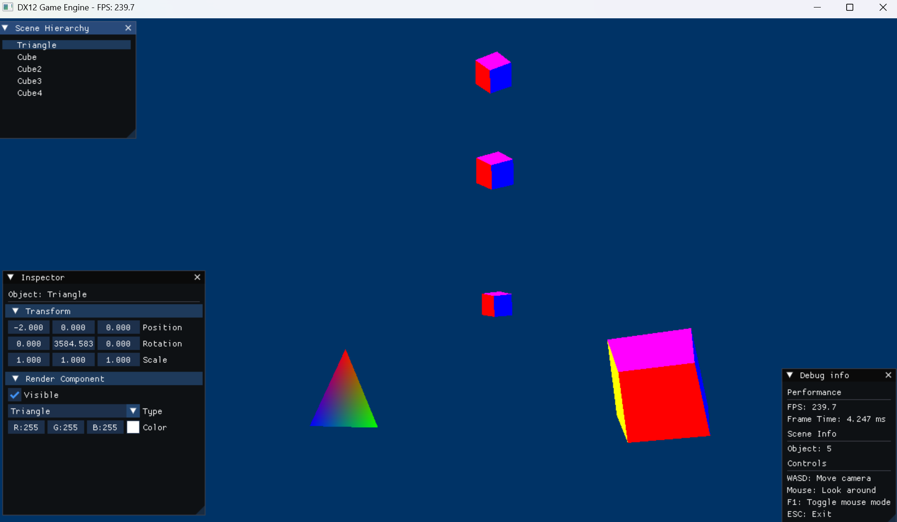

# DirectX12 Game Engine Prototype

このプロジェクトは、高校生が独学で開発している**GameEngine**のプロトタイプです。  
C++ と DirectX12 を使って、エンジン内部の仕組みを一から学びながら構築しています。
Microsoftのリファレンスページや、サンプルコードを見ながら勉強しながらコーディングしています。
---

## 🎯 目的とビジョン

- ゲームエンジンの構造（Scene, Entity, Component, Rendererなど）を理解する
- UnityやUnreal Engineのような再利用性の高いフレームワークを目指す
- 将来的には **簡易エディタ** や **スクリプト連携** も組み込む予定

---

## ✨ 現在の進捗  ImGui導入&実装中

-✅ 完成済み

- レンダリング基盤
- ウィンドウ管理
- シェーダーシステム
- 基本図形描画 (三角形)
- キーボード、マウスインプット機能（将来はゲームパッドも視野に入れている）

---

## 🧱 構成（予定）

- `src/Core/` : エンジン本体（Application、Timer、Logなど）
- `src/Renderer/` : DirectX12ラッパー（Device、SwapChain、Commandなど）
- `src/Game/` : 実際のゲームロジックやオブジェクト
- `assets/` : テクスチャ・モデル・音声ファイル
- `include/` : ヘッダーの一部を分離する予定

---

## 🙌 このプロジェクトについて

高校生として、将来スクエアエニックスのゲームエンジニアになるために、基礎から丁寧に制作中です。

---

## 📧 作者について

- 名前：HEROWL
- X (旧Twitter) : [@HRAKProgrammer] (https://x.com/HRAKProgrammer)
- 開発環境：Visual Studio 2022 / Windows 11 / C++20&23
- 興味分野：ゲームエンジン開発、ゲーム開発、バスケットボール、水上オートバイ運転

